# 📄 DocuMind – Enterprise AI Document Copilot

An AI-powered document intelligence application that enables users to upload one or more PDF documents, generate concise summaries, and ask questions using Retrieval-Augmented Generation (RAG).

DocuMind combines semantic search with Google Gemini to retrieve relevant information only from the uploaded documents, helping reduce hallucinations and provide context-aware responses.

---

## 🌐 Live Demo

**Streamlit App:** https://aishwarya-15sn-documind-app-ttxhcd.streamlit.app/

---

## 🚀 Features

- 📄 Upload one or multiple PDF documents
- 📝 Generate AI-powered document summaries
- 🔍 Semantic search using FAISS and HuggingFace embeddings
- 💬 Ask questions in natural language
- 🎯 Context-aware responses based only on uploaded documents
- 🚫 Answers only from the uploaded document context and indicates when information is unavailable
- 📊 Document analytics (Documents, Pages, Chunks)
- 📥 Download chat history as CSV
- 🗑️ Clear Chat and Reset functionality

---

## 🛠 Tech Stack

| Technology | Purpose |
|------------|---------|
| Python | Backend |
| Streamlit | User Interface |
| LangChain | RAG Pipeline |
| FAISS | Vector Database |
| HuggingFace Embeddings | Semantic Search |
| Google Gemini Flash | Large Language Model |
| PyPDF2 | PDF Text Extraction |
| Pandas | Chat History Export |

---

## ⚙️ How It Works

1. Upload one or more PDF documents.
2. Extract text from the uploaded PDFs.
3. Split the extracted text into smaller chunks.
4. Generate embeddings using HuggingFace.
5. Store embeddings in a FAISS vector database.
6. Retrieve the most relevant document chunks for each query.
7. Send the retrieved context to Google Gemini.
8. Display an answer generated only from the uploaded document context.

---

## 📸 Screenshots

### 🏠 Home
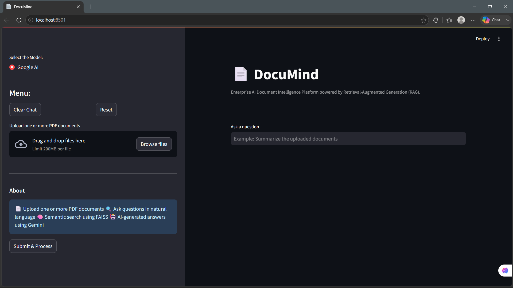

---

### 📄 Upload Multiple PDFs
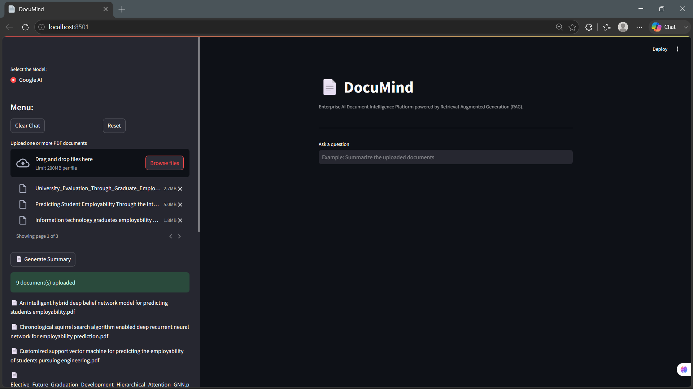

---

### 📝 Generate Document Summary
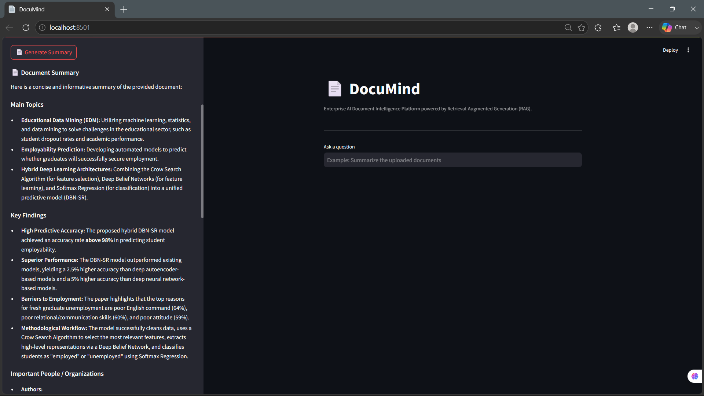

---

### 📚 Knowledge Base Ready
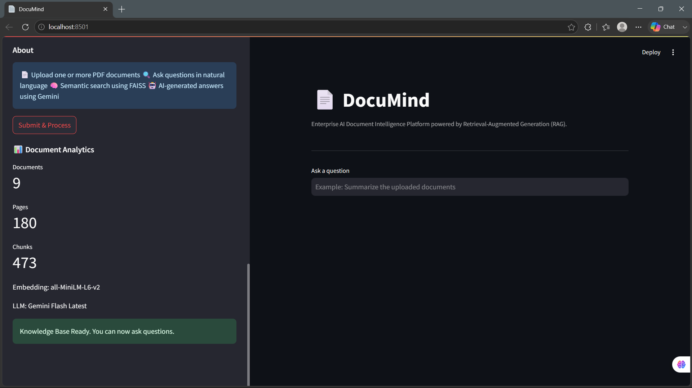

---

### 💬 Question Answering
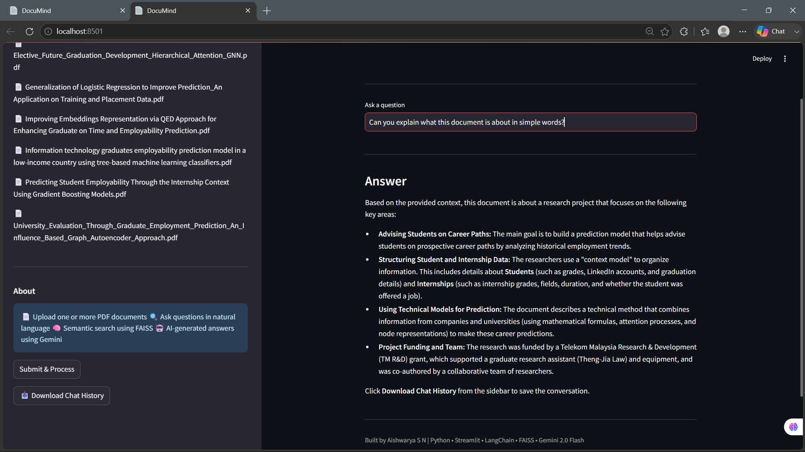

---

### 👥 Entity Extraction
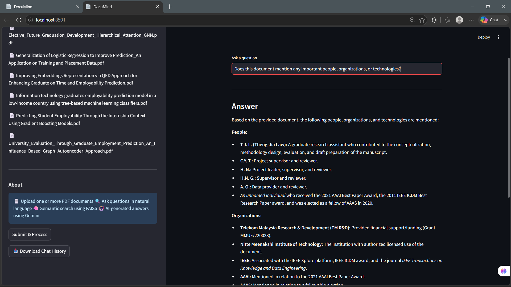

---

### 🚫 Out-of-Context Question
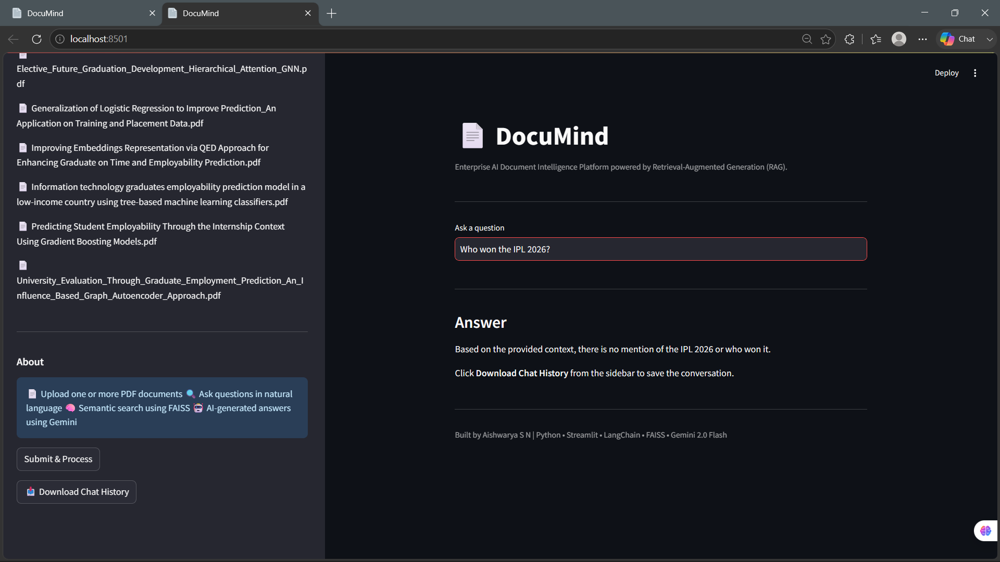

---

### 🧠 Context Awareness
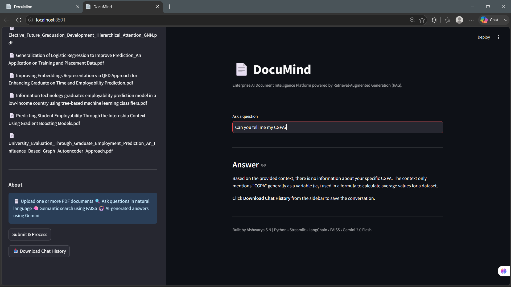

---

### 📥 Download Chat History
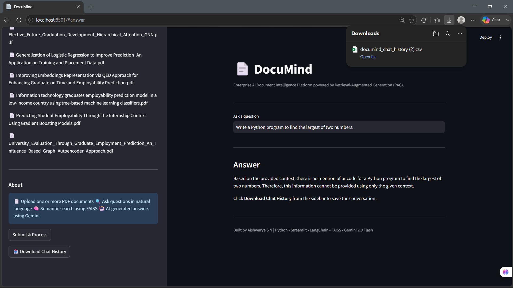

---

### 📊 Exported CSV
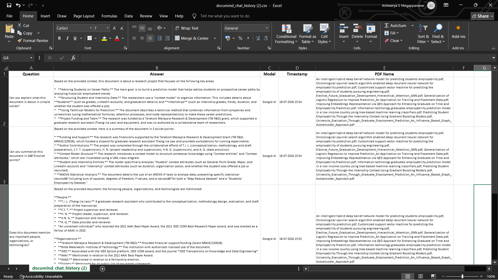

---

### 🗑️ Clear Chat
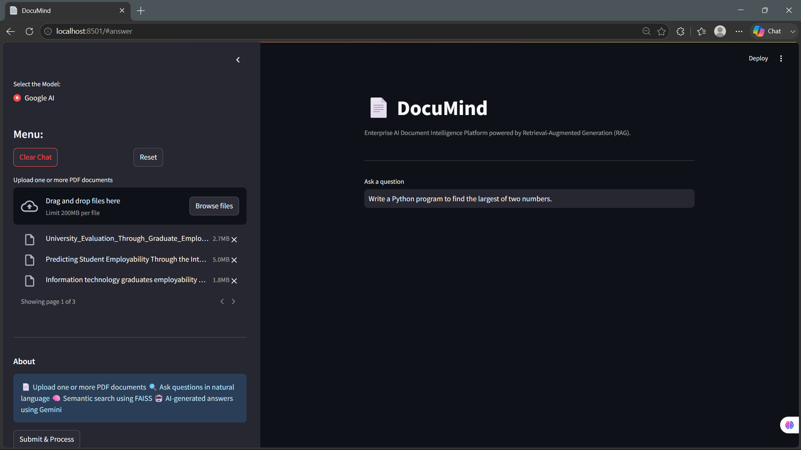

---

### 🔄 Reset Application
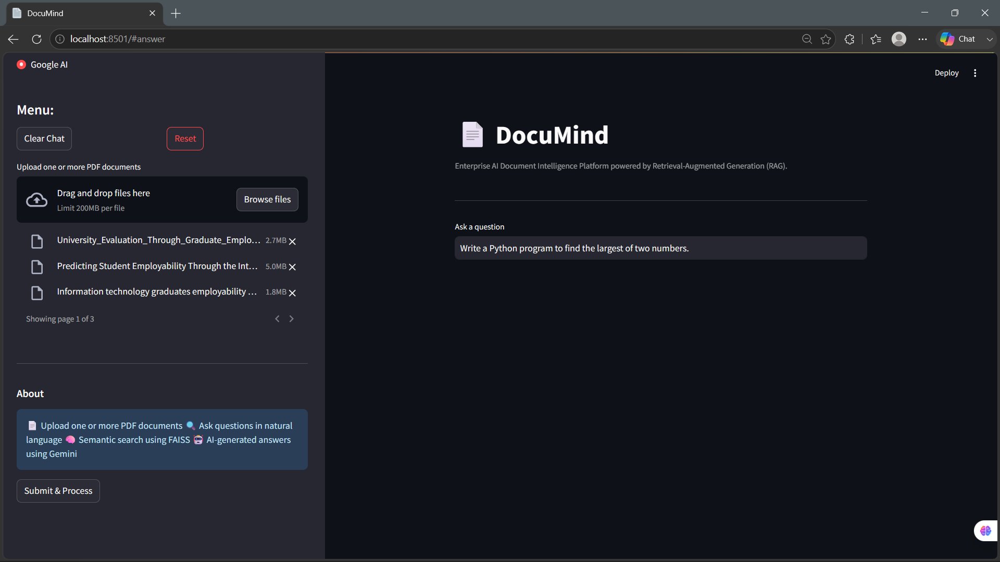

---

## 💻 Installation

Clone the repository

```bash
git clone https://github.com/aishwarya-15sn/documind.git
```

Move into the project directory

```bash
cd documind
```

Install the required packages

```bash
pip install -r requirements.txt
```

Create a Streamlit secrets file

```
.streamlit/secrets.toml
```

Add your Gemini API key

```toml
GOOGLE_API_KEY="YOUR_API_KEY"
```

Run the application

```bash
streamlit run app.py
```

---

## 🔮 Future Improvements

- Support DOCX and TXT documents
- OCR support for scanned PDFs
- Page-wise source citations
- Persistent conversation memory
- Multiple embedding model options
- Cloud deployment

---

## 👩‍💻 Author

**Aishwarya S N**

Electronics & Communication Engineering Student

GitHub: https://github.com/aishwarya-15sn
